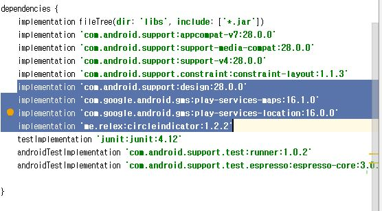

# 🌱전주 공공데이터 api를 파싱한 전주시민 및 관광객들을 위한 앱
## 🌱BY. 김윤서, 김준성, 장진성, 정종범

### 🌱패키지명 통일 kr.go.csejeonju2019

### 🌱개발 시 추가해야하는 라이브러리  :
##### 이모든건 module:app에서 일어납니다 
- google map 사용 시 gradle 최신버전을 쓰지 말기(logo만뜰수있음)
- implementation 'com.android.support:design:28.0.0' (하단바 라이브러리사용)
- implementation 'com.google.android.gms:play-services-maps:16.1.0'(구글지도)
- implementation 'com.google.android.gms:play-services-location:16.0.0'(구글지도)
- implementation 'me.relex:circleindicator:1.2.2'(광고같은녀석 )

 

