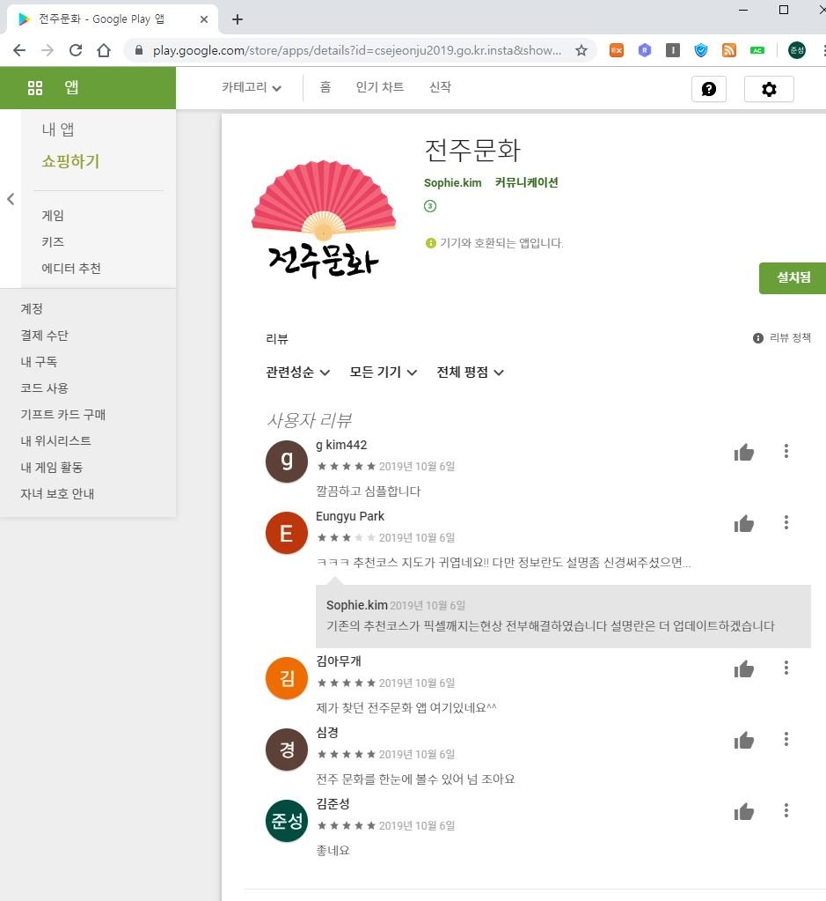
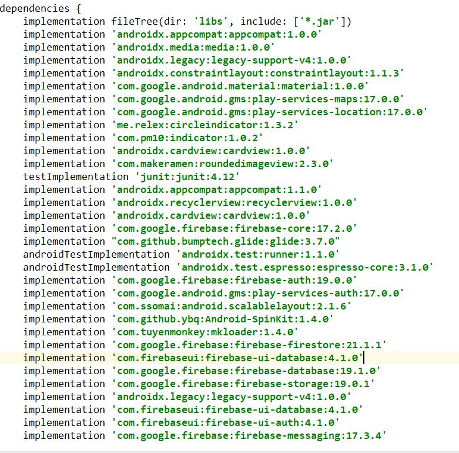

## An android app that provides Jeonju cultural information by parsing Jeonju public data api for Jeonju citizens and tourists 

### :sparkles: Leave Issue if you want to contribute to this project. We welcome your participation at any time.

## You can now download it from the Google Play Store. Download it quickly using the link below.
### 전주문화  - https://play.google.com/store/apps/details?id=csejeonju2019.go.kr.insta

<a href = 'https://play.google.com/store/apps/details?id=csejeonju2019.go.kr.insta'>

### 각자 이름 폴더의 readme와 본 App을 비교하여 팀원들의 contribution을 알 수 있습니다.

 
## Our team member
<table id='team'>
 <tr>
  <td id='김윤서'>
   
   <h4 align='center'><a href = 'https://github.com/SophieYoonseo'>Yoonseo Kim</a>
   </h4>
  </td>
  <td id='김준성'>
   
   <h4 align='center'><a href = 'https://github.com/saechimdaeki'>김준성</a>
   </h4>
  </td>
  <td id='장진성'>
   
   <h4 align='center'><a href = 'https://github.com/ijin1322'>장진성</a>
   </h4>
  </td>
  <td id='정종범'>
   
   <h4 align='center'><a href = 'https://github.com/jjongbumeee'>정종범</a>
   </h4>
  </td>
 </tr>
</table>

## 💻 Developer
*   [SophieYoonseo](https://github.com/SophieYoonseo) - xml data 파싱, 세부디자인, TTS, 아이디어구상, 앱 유지보수
*   [saechimdaeki](https://github.com/saechimdaeki) -  게시판정렬, 전체 디자인 및 코드, 추천코스, 버그수정, 릴리즈관리 
*   [ijin1322](https://github.com/ijin1322) -    게시판 수정삭제 ing , 네이버카카오 로그인 ing, 앱 피드백
*   [jjongbumeee](https://github.com/jjongbumeee) - xml data 파싱, 게시판 수정삭제 ing, 네이버카카오 로그인 ing, 앱 피드백

## 👀 Todo List
* 게시판 수정삭제, 네이버카카오 로그인이 되어있지 않아 완성해야할 필요가 있음. 
* 게시판 정렬이 현재 sharedpreference방식임 이를 바꿔볼 필요가 있음.
* data parsing을 xml이아닌 gson 라이브러리를 이용해 나타낼 필요가 있음. 

## 🤝 How to Contribute
1.  Fork this repository
2.  Create your feature branch (git checkout -b my-new-feature)
3.  Commit your changes (git commit -am 'Add some feature')
4.  Push to the branch (git push origin my-new-feature)
5.  Create new Pull Request

minSdk = 16 으로 진행합니다.
## 굳이 private 이 아닌 public으로 진행하는 이유 
- 꾸준히 발전되는 모습을 보이기위해
- 오픈소스 생태계의 발전을 위해 
- 더좋은 소프트웨어로 발전하기 위해 
- 유지보수를 더 편하게 하기위해 

- 현재 api 파싱은 xml을 xmlpullparser를 이용하여 받고 있습니다. 이 방식을 json으로받아 gson으로 파싱하는 방향으로 바꿔볼 필요가 있음. 

#### 개발 시 추가해야 하는 라이브러리  :
##### 이 모든 건 module:app에서 일어납니다. (--> androidx로 이전하였습니다. )
- 게시판은 firebase OSS 이용
- We used this open source to implement bulletin boards. The sources are as follows. https://github.com/firebase/quickstart-android  

This project is licensed under the terms of the MIT license. See the  file.

 

