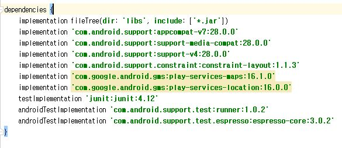

### 전주 공공데이터 api를 파싱한 전주시민 및 관광객들을 위한 앱 

## 김윤서 , 정종범, 장진성, 김준성 

#### 패키지명 통일 kr.go.csejeonju2019

#### 개발 시 주의해야할 사항들 :
- google map 사용 시 gradle 최신버전을 쓰지 말고 이 버전을 써야 지도가 표출됨.
 예를 들어 16.0.0으로 변경 시 google logo만 뜸. (써야하는 버전 사진 첨부 )
 

- java code,및 xml 따로 만들어서 등록 시 activity manifest에 등록하기 

 

