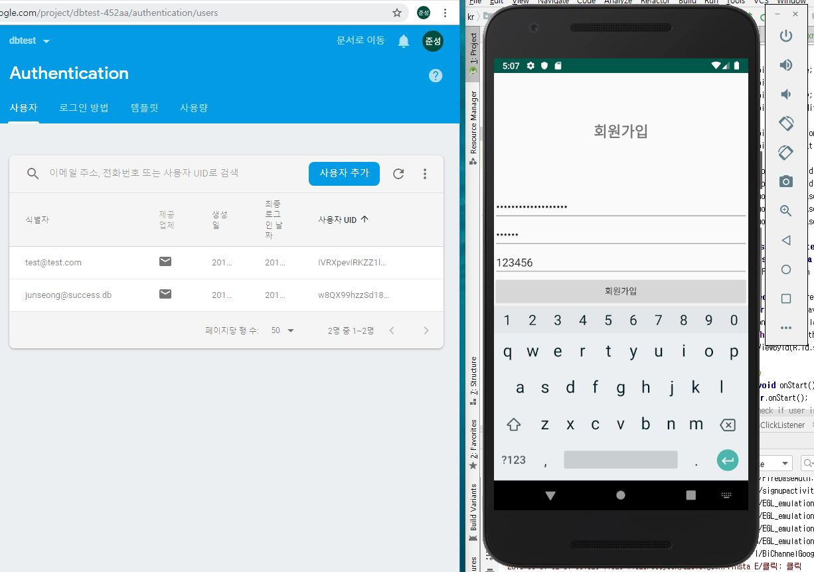
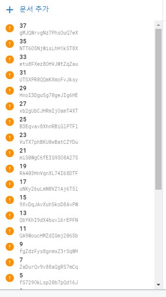
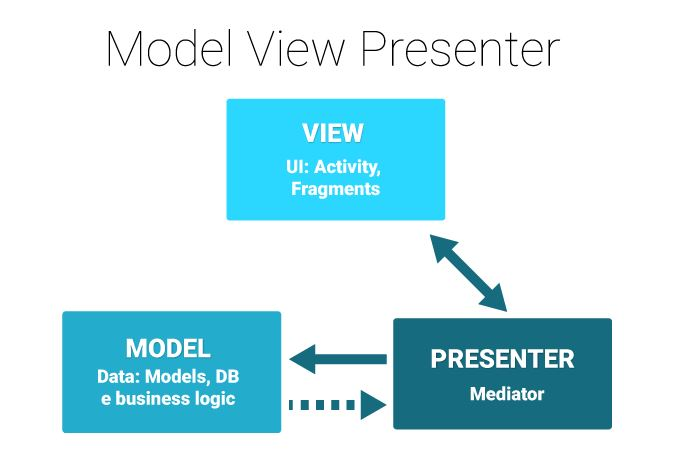

##  `프로젝트 진행상황` (2019.09.09 sophieyoonseo합류  세부디자인시작    --->>> 메인프로젝트인 INSTAGRAM폴더위치 JUNSEONG 에서 공통으로 옮김)
 - main frame 은 width:398, height :629 로 설정해놓음 따라서 fragment설정시 이에따른 비례식을 세워서결정할것 (이점은 수정할사항 레이아웃 머리좋은사람이)
- 🌱INSTAGRAM를 메인프로젝트로 진행중 하단바및 fragment완성
- viewpager를 fragment에 달기성공(인터넷등에는 같이 연동만있지 fragment안에 viewpager넣는건없었음 뇌피셜로 adpater를 같은 클래스안에넣어서 이를 imageview만나타낼것이니 리턴값을두자 했더니 해결 ! )
- home fragment가 다시호출되어 oncreateview를 호출할때 viewpager가 가끔사라지는문제를 child process같은 개념으로 해결 
- 현재까지 구현한 모든기능및디자인 (공유하기 기능 url은 구글마켓등록하면 그거로할예정)
- 사진fragment이동간 indicator가 현재 위치를 표시하게끔 구현
 - 문화공간 리스트 space_list_activity호출 , 문화체험은 experience_list_activity  공연show_list 지정문화재 jijung_cultural 향토는 hyangji 전주지역축제는 festival_list_activity
 - 파싱간 progressbar thread 추가 (09-13)
 - Terminal        gradlew assembleDebug --info
 - 각 카드뷰 클릭시 리스트 그 리스트 클릭시 activity 그 액티비티의 버튼(vector asset)클릭시 event들 구현 09-15(but 공연중 2019독서대전과 나루컬쳐 이두개만 홈페이지접속 클릭시 튕기는현상)
 - 각 리스트정보나나오는 list activity 의 progressbar (기존: 0부터 100까지 100millis ->20millis) 시간단축 (09-17)
 - xmlpullparser 를이용한 파싱리스트인 공연문화정보와 문화체험정보 각 리스트클릭시에 event재구현 및 세부디자인 구현(09-17)
 - 공연문화정보는 위도 경도가없어 show_title이라는 static String 변수에 parsing 정보를 이벤트마다 담아서 이를 youtube관련하여 링크를 뜨게만들음 더정확한 search를위해 int index=show_title.indexOf("-");String show_subtitle=show_title.substring(0,index); 를이용하여 앞의타이틀만 검색되게하려하였으나 이렇게할경우 일부이벤트에서 튕기는현상이발생하여 그냥 show_Title로 진행 (09-17)
- 일단 목표로 했던 세부사항들 완료(09-18) 이제 추천코스 시작할예정 
- dependency 충돌을 막기위해 androidx로 refactoring 
- 각 리스트 클릭시나오는 activity 디자인 추가 + 축제전화번호 이벤트추가+ 추천코스 기능디자인전부구현 디자인과의 연동은 private adpater class로 동작 ( 더이쁘게 세부디자인 및 클릭이벤트는 해야할사항)(09-21)
- 추천코스 디자인 및 각각의 이벤트마다 adapter 구현및 부착 (viewpager + googleapi mMap.addPolyline(new PolylineOptions().add(loc,loc2).width(5).color(Color.rand));)이용 ) (09-21)
- 추천코스 클릭이벤트 mappin change및 시작mappin만다르게 (09-22)
- 안드로이드 게시판 sampleapp gradle 수정및 연동(firebase 09-23) 
- firebase 연동한 게시판sample app refactoring 및 frag3에부착 (생각보다 오류엄청많아서 시간이좀오래걸렸음 09-24)
- 기종마다 비율이다르다는걸 앱출시1주일전에 알아서 이를수정(09-26)
- frag5의 listview click event는 이상하게 이벤트는 받아지는데 넘어가지질않아서 frag5의 사진을 클릭해야 넘어가지게끔 구현함(09-26) 이점은 실력부족으로 이렇게 대체한것 
- frag5의 recommend 세부사항들 viewpager adpater에 clickevent구현 각 사진마다 그사진에따른 url로 이동이 가능해짐 (09-27) 
- 기존 20millis-> 12millis (1.6배 속도 progressbar thread 속도개선) 
- 게시판에 임의로 datanumㅇ라는 field를 만들어서 호출될때마다 +2 하게하였구 firebase query를통해 내림차순으로 recent post를 구현하였음(09-28) 
- 9월 28일날 구현한 정렬기능은 앱을껏다킬시에 datanum이 0으로초기화되어서 recentpost의 정렬이 꼬이는문제가있었음. 이에 stackoverflow에서 검색등을통해 key1string 에 datanum을 저장시키고 commit 후 submitpost를 호출할때마다 datanum을 ++ 한후 key1값에 저장되었던 value인 datanum을 불러들임 물론 final처리해서 변수를만든후 이값을 다시 datanum에 집어넣음  이렇게하면은 newpost를호출할때마다 datanum이 1개씩늘어나는것을 firestore를통해 확인하였고 정렬은 이 구현한 datanum을 query문을통해 내림차순으로 정렬하였다.(0930 01:45)
- 앞선정렬을 잠자고일어나서 테스트결과 다시 꼬이는현상이발생하였다. 아침에눈뜨자마자 별수를 다해보았으나 앱을 강제종료하거나 디바이스를 reboot할시 내가 정렬을 위해 저장하였던 변수가 0으로다시초기화되는현상발생 이를해결하는데는 간단히 내가놓친게있었지만 발견하기가어려웠다 암튼 해결하였다 이제 앱을껏다키거나 reboot , 및 강제종료를해도 게시판은정렬될것이다(09-30 09:50)
- 파싱이 안되는 일부기기들을 위한 errorlist 및 이에클릭포지션에따른 처리 클래스들을만들음 (공연정보 및 문화체험) (10-01)
- 파이어베이스 게시판 나의게시글은 자신의 토큰을 받는 post만 datanum에따라서 내림차순으로 나오게끔 구현하였음 또한 addaptive app icon을통해 둥글고 모든기기마다 짤리지않고나오게끔 만들었음 (10-02)
- 좋아요가많은 나의 게시글은 uid를통해 토큰을받아 starcount내림차순 으로 정렬한후에 datanum에따라 정렬함. 즉, 좋아요가많고 가장최신일경우 fragment의 최상단에 놓임(10-04)
## 눈으로보는 현재구현내용 (클릭시 이벤트는 하나하나하면 길어서 생략) 

- DB_INSTA 라는 폴더명에 회원가입및 FIREBASE연동 그리고 DB활성화 

- 최근게시글의 정렬은 sharedpreference를통해 key1값을두어 private로 저장. 후에 datanum이라는 static변수를 받아 query문을통한 내림차순으로 정렬되게끔 구현하였습니다 (즉 정렬은 datanum이라는변수를통해서 이뤄집니다)

## 제가작성한 일부분의 기능구현및코드는 Mvp pattern을 적용합니다

## code merge and design detail
- 9월9일 ~ sophieyoonseo 합류 instagram 앱에 문화체험, 공연정보 xmlpullparser 합침.
- cardview 축제정보 +및 레이아웃 배치조정 

## 사용한 공공데이터 목록 ( for 제출 서류 ) 
- 지정문화재 검색 서비스 목록
- 문화공간 정보 서비스 목록
- 문화체험 정보 서비스 목록
- 전주시 공연행사 신규 서비스
- 향토문화유산 검색서비스 목록

### Android Asset Studio
- https://romannurik.github.io/AndroidAssetStudio/index.html

## 기능들 구현및 fragment<->activty 구상이 안잡혀서 그린 매핑 . 
   

## 앞으로해야할일  
- 세부디자인 및 바텀네비게이션 일부기종에서는 matchparent하여도 width가꽉안참
- https://stackoverflow.com/questions/41432902/bottomnavigationview-is-not-full-width/41433309#41433309
.## 진행상어려운점
- firebase 게시글 수정, 삭제는 중간고사를 끝나고 playstore에 릴리즈한버젼을 upate할예정  remove button을달아서 시도하여봣으나 detail클릭에서의 오류로인한 보류 .

