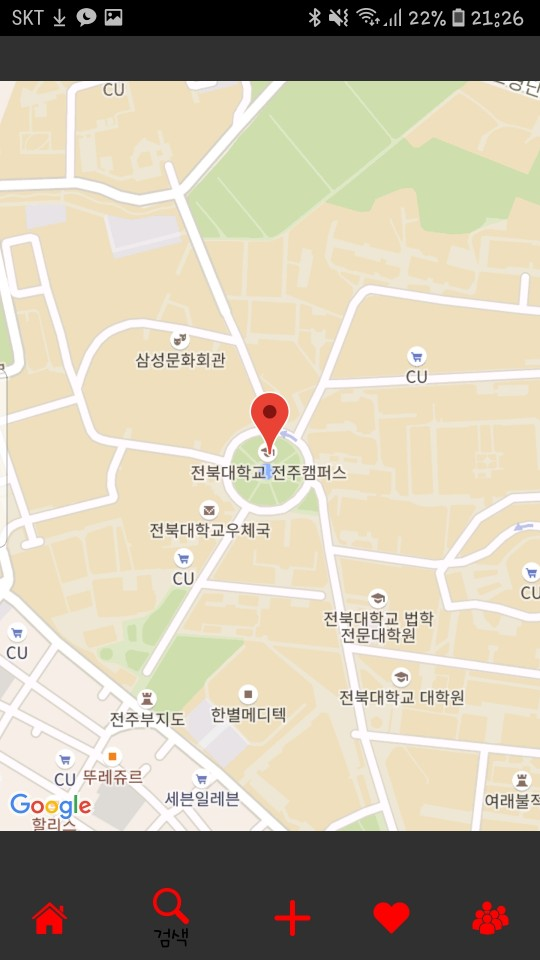

## 김준성 진행상황

- insta를 메인프로젝트로 진행중 하단바및 fragment완성

- swipe로 이미지변환하는것은 indicator_again이란 프로젝트로 완성 (천우희가 이미지가 변경되는 간단한 sample app)

### 어려운점..
- 단순히 합치는것이 액티비티안의 액티비티라고 생각햇지만 안드로이드가 까다로워서 그렇게는 안된다고함 고로 fragment 안의 fragment안의 fragment해야하는데 자바문법에서 어려움..